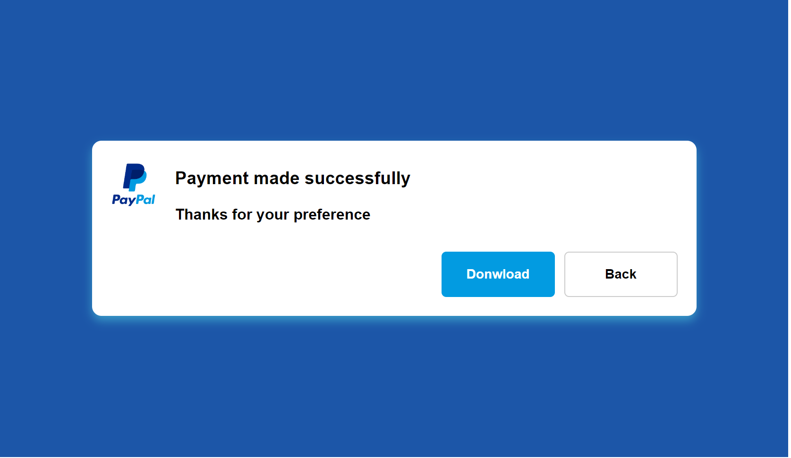

# PayPal Confirm

This is a paypal payment done in html and css

# Screen Project



# Install

```sh
git clone https://github.com/asalinasf/confirm-paypal/
cd confirm-paypal
open in your browse
```

# HTML
```html
<!DOCTYPE html>
<html lang="es">

<head>
    <meta charset="UTF-8">
    <meta http-equiv="X-UA-Compatible" content="IE=edge">
    <meta name="viewport" content="width=device-width, initial-scale=1.0">
    <link rel="stylesheet" href="styles.css">
    <title>Confirm PayPal</title>
</head>

<body>
    <div class="contenedor">
        <div class="sub-contenedor">
            <div class="contenido">
                <div class="icon">
                    
                </div>
                <div class="mensaje">
                    <div class="title">
                        <h3>
                            Payment made successfully
                        </h3>
                        <div class="text">
                            Thanks for your preference
                        </div>
                    </div>
                </div>
            </div>
            <div class="actions">
                <button class="btn-descargar">Donwload</button>
                <button class="btn-volver">Back</button>
            </div>
        </div>
    </div>
</body>

</html>
```

# CSS
```css
body{
    margin: 0;
    padding: 0;
    font-family: Arial, Helvetica, sans-serif;
    box-sizing: border-box;
}
.contenedor{
    background-color: #1c56a8;
    display: flex;
    width: 100%;
    height: 100%;
    align-items: center;
    justify-content: center;
    position: fixed;
}
.contenedor .sub-contenedor{
    width: 600px;
    border-radius: 10px;
    background-color: white;
    padding: 10px 20px;
    box-shadow: 0px 5px 10px rgba(83, 221, 231, 0.5);
}
.contenedor .sub-contenedor .contenido{
    display: flex;
    gap: 10px;
    align-items: center;
    margin-bottom: 20px;
    flex:auto
}
.contenedor .sub-contenedor .contenido .icon {
    margin-right: 10px;

}
.contenedor .sub-contenedor .contenido .mensaje .title{
    font-weight: bolder;

}
.contenedor .sub-contenedor .actions{
    padding:10px 0px;
    display: flex;
    justify-content: end;
    gap: 10px;
}
.contenedor .sub-contenedor .actions button{
    border: none;
    padding: 15px;
    min-width: 120px;
    border-radius: 5px;
    font-weight: bold;
    font-size: 14px;
    cursor: pointer;
}
.contenedor .sub-contenedor .actions .btn-descargar{
    background-color: #029BE1;
    color: white;
}
.contenedor .sub-contenedor .actions .btn-descargar:hover{
    background-color: #0280DE;
}
.contenedor .sub-contenedor .actions .btn-volver{
    background-color: white;
    border: solid 1px #ccc;
}
.contenedor .sub-contenedor .actions .btn-volver:hover{
    background-color: #eee;
}
@media (max-width: 600px){
    .contenedor .sub-contenedor{
        width: 80%;
    }
.contenedor .sub-contenedor .actions{
    flex-direction: column;
}

}


```
# Visit my project with this url

https://pago-aaronsalinas.netlify.app/
